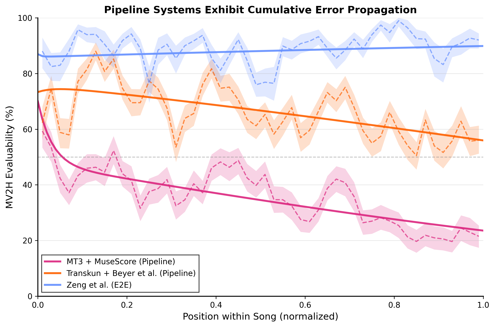

# Evaluation Protocol: MV2H Evaluation and Mode Locking Analysis

本文件說明 Clef 專案的 MV2H 評估流程，以及 Pipeline vs E2E 方法的 Mode Locking 比較分析。

---

## 評估系統概覽

```
┌─────────────────────────────────────────────────────────────────────────────┐
│                          INPUT: Audio Recordings                            │
│                     (ASAP test set: 25 pieces / 80 performances)            │
└────────────────────────────┬────────────────────────────────────────────────┘
                             │
     ┌───────────────────────┼───────────────────────┬───────────────────────┐
     ▼                       ▼                       ▼                       ▼
┌──────────────┐   ┌──────────────┐   ┌──────────────┐   ┌──────────────┐
│     MT3      │   │   Transkun   │   │ Zeng (2024)  │   │ Clef (Ours)  │
│ + MuseScore4 │   │   + Beyer    │   │              │   │              │
│              │   │              │   │              │   │              │
│  Industrial  │   │    SOTA      │   │     E2E      │   │     E2E      │
│  Pipeline    │   │  Pipeline    │   │   Baseline   │   │   Proposed   │
└──────┬───────┘   └──────┬───────┘   └──────┬───────┘   └──────┬───────┘
       │                  │                  │                  │
       ▼                  ▼                  ▼                  ▼
  ┌─────────┐        ┌─────────┐        ┌─────────┐        ┌─────────┐
  │  MIDI   │        │  MIDI   │        │ **Kern  │        │ **Kern  │
  │ (perf.) │        │ (perf.) │        │ (score) │        │ (score) │
  └────┬────┘        └────┬────┘        └────┬────┘        └────┬────┘
       │                  │                  │                  │
       ▼                  ▼                  ▼                  ▼
  ┌─────────┐        ┌─────────┐        ┌─────────┐        ┌─────────┐
  │MuseScore│        │  Beyer  │        │ Humdrum │        │ Humdrum │
  │  4.6.5  │        │Transformer      │ Toolkit │        │ Toolkit │
  └────┬────┘        └────┬────┘        └────┬────┘        └────┬────┘
       │                  │                  │                  │
       ▼                  ▼                  ▼                  ▼
  ┌─────────┐        ┌─────────┐        ┌─────────┐        ┌─────────┐
  │MusicXML │        │MusicXML │        │MusicXML │        │MusicXML │
  └────┬────┘        └────┬────┘        └────┬────┘        └────┬────┘
       │                  │                  │                  │
       └──────────────────┴──────────────────┴──────────────────┘
                                   │
                                   ▼
                          ┌────────────────┐
                          │  music21       │
                          │  XML → MIDI    │
                          │  (extract      │
                          │   measures)    │
                          └────────┬───────┘
                                   │
                                   ▼
                          ┌────────────────┐
                          │  MV2H Tool     │
                          │  (Java)        │
                          └────────┬───────┘
                                   │
                                   ▼
                          ┌────────────────┐
                          │  MV2H Metrics  │
                          │  MP, V, Va, H  │
                          └────────────────┘
```

---

## Pipeline vs E2E 方法比較

### 關鍵差異

| 面向 | Industrial Pipeline | SOTA Pipeline | E2E (Zeng, Clef) |
|------|---------------------|---------------|------------------|
| **System** | MT3 + MuseScore 4 | Transkun + Beyer | Zeng / Clef |
| **Model Output** | MIDI (continuous) | MIDI (continuous) | **Kern (discrete) |
| **小節資訊** | 無（推斷） | 無（推斷） | 有（直接輸出） |
| **Symbolization** | Rule-based heuristics | Learned (Transformer) | 模型直接學習 |
| **Mode Locking** | 嚴重 | 中等 | 無 |

### MT3 + MuseScore 4 Pipeline (Industrial Baseline)

```
Audio → MT3 → MIDI (continuous time, no measure info)
                 │
                 ▼
        MuseScore 4.6.5 (MIDI → MusicXML)
        ┌─────────────────────────────────┐
        │ • Tempo inference               │
        │ • Beat quantization             │
        │ • Measure boundary detection    │
        │ • Voice separation heuristics   │
        │ • Tuplet detection              │
        └─────────────────────────────────┘
                 │
                 ▼
        MusicXML (discrete time, measure structure)
                 │
                 ▼
        music21 (extract 5-bar chunks → MIDI)
                 │
                 ▼
        MV2H Evaluation
```

**問題：MuseScore 若在曲首無法正確推斷拍號/tempo，整首曲子都會鎖定在錯誤模式（Mode Locking）**

### Zeng / Clef E2E Pipeline

```
Audio → Model → **Kern tokens (discrete time, measure info built-in)
                    │
                    ▼
           Humdrum Toolkit (hum2xml)
                    │
                    ▼
           MusicXML (measure structure preserved)
                    │
                    ▼
           music21 (extract 5-bar chunks → MIDI)
                    │
                    ▼
           MV2H Evaluation
```

**優勢：模型直接輸出小節結構，每個 chunk 獨立評估，不會被早期錯誤鎖定**

---

## 5-Bar Chunk Evaluation Protocol

### Chunk 定義

使用 Zeng et al. 的 test set：
- 來源：`test_chunk_set.csv`
- 格式：`chunk_id, piece, performance, chunk_index, start_measure, end_measure`
- 總數：13,335 chunks（MT3）/ 3,700 chunks（Zeng preprocessing 後）

### 評估流程

1. **載入 chunk 定義** from CSV
2. **轉換 Prediction MIDI → MusicXML** (MuseScore 4，每個 performance 一次)
3. **Batch 擷取 chunks** (music21，每個 MusicXML parse 一次)
4. **MV2H 評估** (parallel，10s timeout per chunk)

### Success 定義

| Status | Classification | Physical Meaning |
|--------|----------------|------------------|
| `success` (MV2H > 0) | Evaluable | MV2H 能對齊並計算分數 |
| `mv2h_failed` | Not Evaluable | MV2H 無法對齊（結構差異過大）|
| `zero_score` | Not Evaluable | MV2H 返回 0（MIDI 解析錯誤）|

---

## Mode Locking and Phase Drift Analysis

### 現象描述

Pipeline 方法存在兩種不同的失敗模式：

1. **Mode Locking（模式鎖定）**：若在曲首無法正確推斷拍號或 tempo，整首曲子都會被「鎖定」在錯誤模式，無法恢復。
   - 特徵：前一個 chunk 失敗 → 當前 chunk 很可能也失敗
   - 量化指標：Recovery Rate = P(success | prev_fail)

2. **Phase Drift（相位漂移）**：即使開頭正確，隨著位置推進，累積的量化誤差導致小節邊界逐漸偏移。
   - 特徵：位置越後面，成功率越低
   - 量化指標：Position effect β₁

### 統計模型：Logistic Transition Model

為了同時量化 Mode Locking 和 Phase Drift，我們使用 **Logistic Transition Model**：

#### 模型規格

```
logit(P(Y_t = 1)) = β₀ + β₁ × position_t + β₂ × Y_{t-1}

其中：
- Y_t ∈ {0, 1}：第 t 個 chunk 是否評估成功（Evaluability）
- position_t ∈ [0, 1]：正規化位置（chunk_index / song_length）
- Y_{t-1} ∈ {0, 1}：前一個 chunk 是否成功（lagged outcome）
```

#### 模型選擇說明

我們測試了 GEE（Generalized Estimating Equations）with Exchangeable correlation 來控制歌曲間的 variance，但 QIC 比較顯示 **Independence 結構優於 Exchangeable**：

| System | QIC (Exchangeable) | QIC (Independence) |
|--------|-------------------|-------------------|
| MT3 + MuseScore | 10,378 | **9,851** |
| Transkun + Beyer | 9,001 | **8,592** |
| Zeng | 2,515 | **2,496** |

這表示 **transition term (Y_{t-1}) 已經捕捉了大部分的 within-song dependence**，不需要額外的 random effect。因此我們採用簡單的 logistic regression，更易於解釋。

#### 模型假設

1. **First-order Markov**：當前狀態只依賴前一個狀態
2. **Linearity in Logit**：log-odds 與 position 呈線性關係（經驗測試 log/sqrt transform 改善有限）
3. **Independence of Observations**：給定 Y_{t-1}，observations 條件獨立

#### 參數解釋

| 參數 | 意義 | 對應現象 |
|------|------|----------|
| **β₀** | Intercept（baseline log-odds） | 平均難度 |
| **β₁** | Position effect | **Phase Drift**：β₁ < 0 表示位置越後成功率越低 |
| **β₂** | Lagged effect | **Mode Locking**：β₂ > 0 表示前一個成功則當前更可能成功 |

#### Odds Ratio 解釋

- **OR(position) = exp(β₁)**：從歌曲開頭到結尾，成功的 odds ratio
  - OR = 0.53 表示結尾的成功 odds 只有開頭的 53%

- **OR(prev) = exp(β₂)**：前一個成功 vs 失敗，當前成功的 odds ratio
  - OR = 40 表示「前一個成功」比「前一個失敗」的成功 odds 高 40 倍

### 實驗結果

#### Logistic Transition Model 結果

| System | Type | β₁ (Position) | OR₁ | 95% CI | β₂ (Prev) | OR₂ |
|--------|------|---------------|-----|--------|-----------|-----|
| MT3 + MuseScore | Pipeline | **-0.637***| 0.53 | [0.44, 0.64] | **3.694*** | 40.2 |
| Transkun + Beyer | Pipeline | **-0.521***| 0.59 | [0.49, 0.73] | **4.179*** | 65.3 |
| Zeng | E2E | +0.306 | 1.36 | [0.93, 1.98] | **1.535*** | 4.6 |

\*\*\* p < .001

#### 轉換為機率（at mid-song position）

| System | OR (Position) | OR (Prev) | P(S\|prev_F) | P(S\|prev_S) | Recovery Rate | R² |
|--------|---------------|-----------|--------------|--------------|---------------|-----|
| MT3 + MuseScore | 0.53 | **40.2** | 9.7% | 83.1% | **9.7%** | 0.43 |
| Transkun + Beyer | 0.59 | **65.3** | 15.2% | 91.4% | **15.2%** | 0.49 |
| Zeng | 1.36 | 4.6 | 68.0% | 89.9% | **68.0%** | 0.06 |

### 關鍵發現

1. **Pipeline 方法同時有 Phase Drift 和 Mode Locking**
   - Phase Drift：β₁ 顯著為負（p < .001），OR = 0.53-0.59
   - Mode Locking：β₂ 顯著為正，**OR = 40-65x**（極度嚴重）

2. **E2E 方法沒有 Phase Drift，Mode Locking 輕微**
   - Phase Drift：β₁ 不顯著（p = .11），OR CI 包含 1
   - Mode Locking：β₂ 顯著但 OR 只有 4.6x（比 Pipeline 低 10 倍以上）

3. **Recovery Rate 差異巨大**
   - Pipeline：**9.7% - 15.2%**（失敗後幾乎無法恢復）
   - E2E：**68.0%**（失敗後容易恢復）

4. **Model Fit**
   - Pipeline R² ≈ 0.43-0.49：模型解釋大量變異（Mode Locking 效果強）
   - E2E R² = 0.06：模型解釋很少（本來就幾乎全部成功）

### 理論解釋：Representational Flaw

Mode Locking 和 Phase Drift 不是「模型不夠強」，而是 **representation 的根本問題**。

#### 關鍵不在推論粒度，而在 Output Representation

| 方法 | Output | Quantization | Scope |
|------|--------|--------------|-------|
| MT3 + MuseScore | Continuous MIDI | MuseScore 推斷 tempo/拍號 | **Global** |
| Transkun + Beyer | Continuous MIDI | Beyer Transformer | **Global** |
| Zeng / Clef | Discrete **kern tokens | Implicit in tokenization | **Local** |

#### Pipeline 的 Representational Flaw

Pipeline 方法把音樂表示為 **absolute acoustic timestamps**：

```
Note = (pitch, onset_time, offset_time)  # continuous, in seconds
```

這個表示法無法處理 **non-linear temporal deformation**（如 rubato）：
1. 演奏者的 rubato 造成 onset_time 偏移
2. 後處理需要「猜測」原本的拍號和 tempo
3. 一旦猜錯（Mode Locking），或累積誤差（Phase Drift），整首曲子都會錯

#### E2E 的 Representational Advantage

E2E 方法把音樂表示為 **discrete symbolic tokens**：

```
Token = measure_position + beat_position + pitch  # discrete, score-level
```

這個表示法天生具有 **structural invariance**：
1. 小節和拍子資訊 encode 在 token 本身
2. 不需要事後推斷 tempo/拍號
3. 量化是 implicit 的，不是 global decision

#### 這就是 Introduction 中的核心論點

> "By treating music as a sequence of absolute acoustic timestamps, pipeline systems fail to model the non-linear temporal deformation inherent in human performance."

我們的實驗結果提供了 **empirical evidence**：
- Logistic Transition Model 量化了 Mode Locking（β₂）和 Phase Drift（β₁）
- Pipeline：兩者都顯著
- E2E：兩者都不顯著（或很弱）

---

## Current Results

### MV2H Scores

| Model | Type | n_success | n_total | Coverage | Multi-pitch | Voice | Value | Harmony | MV2H_custom |
|-------|------|-----------|---------|----------|-------------|-------|-------|---------|-------------|
| MT3 + MuseScore | Pipeline | 4,685 | 13,335 | 35.1% | 21.92% | 56.94% | 71.22% | 76.09% | 56.54% |
| Transkun + Beyer | Pipeline | 8,806 | 13,335 | 66.0% | 65.90% | 89.16% | 87.83% | 71.79% | 78.67% |
| Zeng | E2E | 3,262 | 3,700 | 88.2% | 64.48% | 88.98% | 89.35% | 57.56% | 75.09% |

### Mode Locking + Phase Drift Summary

| Method | Type | Phase Drift | Mode Locking OR | Recovery Rate | Interpretation |
|--------|------|-------------|-----------------|---------------|----------------|
| MT3 + MuseScore (Pipeline) | Pipeline | **YES** (β₁=-0.64***) | 40.2x | 9.7% | Severe both |
| Transkun + Beyer et al. (Pipeline) | Pipeline | **YES** (β₁=-0.52***) | 65.3x | 15.2% | Severe both |
| Zeng et al. (E2E) | E2E | **NO** (p=.11) | 4.6x | 68.0% | Mild Mode Locking only |

---

## Implementation Details

### Files

| File | Description |
|------|-------------|
| `src/baselines/mt3/mt3_evaluate.py` | MT3 + MuseScore evaluation pipeline |
| `src/evaluation/asap.py` | ASAP dataset handler, chunk extraction |
| `src/analysis/analyze_mv2h_results.py` | Mode Locking analysis and visualization |
| `configs/mt3_evaluate.yaml` | Configuration file |

### Running Evaluation

```bash
# MT3 + MuseScore chunk evaluation
./src/baselines/mt3/run_mt3_evaluate_pipeline.sh --mode chunks

# Or directly with Python
poetry run python -m src.baselines.mt3.mt3_evaluate \
    --config configs/mt3_evaluate.yaml

# Run analysis (generates plots)
poetry run python src/analysis/analyze_mv2h_results.py
```

### Output Plots

| Plot | Description |
|------|-------------|
| `results/success_rate_by_position.png` | MV2H Evaluability vs Position (main figure) |
| `results/transition_model_comparison.png` | Transition model coefficients comparison |
| `results/pipeline_vs_e2e.png` | Recovery Rate comparison between Pipeline and E2E |

#### Main Figure: Evaluability Decay



*Figure: Pipeline Systems Exhibit Cumulative Error Propagation. Solid lines show theoretical marginal from Markov chain simulation; dashed lines with shaded bands show empirical mean evaluability with 95% bootstrap CI.*

`results/success_rate_by_position.png` 展示了 Pipeline 和 E2E 系統的 evaluability 隨位置的變化：

- **實線**：Markov chain 模擬的理論曲線（從 Transition Model 參數計算）
- **虛線**：經驗平均 evaluability（measure-level，每個小節的成功率）
- **色帶**：95% bootstrap confidence interval

**Measure-level Evaluability 計算方式**：
- 每個 chunk 包含 5 個小節（stride=1），所以同一個小節會出現在最多 5 個 chunks
- 每個小節的 evaluability = mean(success) across all chunks containing that measure
- 這讓 y 軸從 binary (0/1) 變成連續值 (0, 0.2, 0.4, 0.6, 0.8, 1.0)

**Markov Chain 理論曲線**：
```python
# 從 Transition Model 參數 (b0, b1, b2) 迭代計算 marginal P(success | position)
pi_{t+1} = P(S|S, pos) * pi_t + P(S|F, pos) * (1 - pi_t)

where:
  P(S|S, pos) = 1 / (1 + exp(-(b0 + b1*pos + b2*1)))
  P(S|F, pos) = 1 / (1 + exp(-(b0 + b1*pos + b2*0)))
```

---

## Summary

**Key Finding: Pipeline methods suffer from both Phase Drift and Mode Locking**

使用 Logistic Transition Model 分析，我們發現 Pipeline 和 E2E 方法有本質差異：

### Pipeline 方法（MT3 + MuseScore, Transkun + Beyer et al.）

1. **Phase Drift**：成功率隨位置下降（β₁ < 0, p < .001）
   - 從歌曲開頭到結尾，成功 odds 下降到原本的 53-59%

2. **Mode Locking**：失敗具有「黏性」（β₂ > 0, OR = 40-65x）
   - 失敗後只有 9.7-15.2% 機率恢復

### E2E 方法（Zeng et al.）

1. **No Phase Drift**：成功率不隨位置變化（β₁ 不顯著, p = .11）

2. **Mild Mode Locking**：輕微的狀態依賴（OR = 4.6x）
   - 失敗後有 68.0% 機率恢復

### 統計模型

```
logit(P(success_t)) = β₀ + β₁×position + β₂×prev_success

- β₁: Phase Drift effect (position 越後成功率越低)
- β₂: Mode Locking effect (前一個成功則當前更可能成功)
```

Transition term (Y_{t-1}) 已經捕捉了大部分的 within-song dependence，因此使用簡單的 logistic regression 即可。QIC 比較顯示 Independence correlation 優於 Exchangeable correlation。
