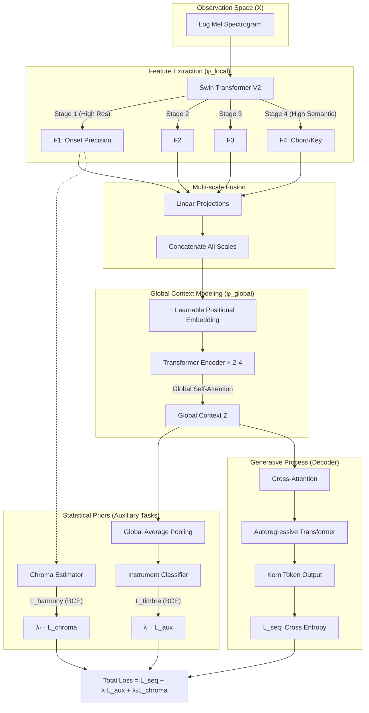

# Clef 模型架構

本文件整合了 Clef 架構的核心設計理念，涵蓋 Encoder 選型、Bridge 機制、Auxiliary Loss 設計，以及統計學觀點的詮釋。

---

## 1. 三種架構比較

以下用「數據流（Data Flow）」和「歸納偏置（Inductive Bias）」來拆解 Whisper、標準 VLM 與 Clef 的差異：

### 1.1 Whisper (OpenAI) — 「聽覺」模型

Whisper 是標準的 **Speech-to-Text** 架構，核心假設是：**聲音是隨時間變化的 1D 序列**。

- **輸入**: Log-Mel Spectrogram（被視為時間序列）
- **Encoder**: Audio Transformer（使用 1D-Convolution 壓縮時間軸）
  - 掃描的是 **「時間 (Time)」**，關注前後關係
  - **歸納偏置**：語音偏見，擅長捕捉 Formants 和 Phonemes，對時間極度敏感，但對「垂直頻率堆疊（和聲）」不敏感
- **Decoder**: Text Transformer

**評價**：拿它來轉譜會失敗，因為它會忽略和聲結構，只在意旋律線。

### 1.2 Vision-Language Model (如 LLaVA / Legato) — 「視覺」模型

這是目前 AI 界的主流，核心假設是：**輸入是 2D 空間中的物體**。

- **輸入**: RGB Image 或 Score Image（樂譜圖片）
- **Encoder**: ViT (Vision Transformer)
  - 將圖片切成 $16 \times 16$ Patches
  - 掃描的是 **「空間 (Space)」**，關注幾何關係
  - **歸納偏置**：物體恆常性（平移不變性）
- **Decoder**: LLM (Text Transformer)

### 1.3 Clef (Swin-V2 + Bridge + Transformer) — 「跨模態」模型

Clef 的架構在數學上 **不等於** 標準 VLM，採用混合設計來適配音樂的獨特結構：

- **輸入**: Log-Mel Spectrogram
- **Encoder**: Swin Transformer V2 + Global Bridge
  - **Swin V2 前端**：使用相對位置偏差（Relative Position Bias）與階層式視窗機制
  - **Global Bridge**：2-4 層標準 Transformer Encoder，提供跨段落的全域注意力機制
  - **Frozen Weights**：Swin V2 的預訓練權重可直接凍結，因為其相對位置偏差與輸入長度無關
- **Decoder**: Autoregressive Transformer

**Clef 抓到的特徵**：
- **Swin 的局部注意力**：垂直線（節奏/Onset）、水平線（音高）、垂直堆疊的距離（和聲/Intervals）
- **Bridge 的全域注意力**：段落呼應（Intro ↔ Outro）、主題重複（副歌結構）、跨小節的和聲進行

### 1.4 比較總表

| **特徵**           | **Whisper**                   | **Standard VLM (Legato)**    | **Clef**                                  |
| ------------------ | ----------------------------- | ---------------------------- | ----------------------------------------- |
| **輸入資料**       | 聲音頻譜 (Audio)              | 真實照片 / 樂譜圖片          | **聲音頻譜 (Audio)**                      |
| **看待資料的方式** | 1D 時間序列 (Time-Series)     | 2D 空間幾何 (Spatial)        | **2D 頻譜圖 + 階層式處理** (Hierarchical) |
| **Encoder 架構**   | Audio Transformer (1D Conv)   | ViT (2D Patch)               | **Swin-V2 (Window) + Bridge (Global)**    |
| **位置編碼**       | Sinusoidal (絕對)             | Learnable (絕對)             | **Relative Bias + Learnable (相對+絕對)** |
| **預訓練來源**     | 語音數據 (Speech)             | ImageNet (Objects)           | **ImageNet (Objects)**                    |
| **擅長捕捉**       | 語音內容、時間流動            | 物體形狀、邊緣、紋理         | **和聲結構、音色紋理、段落呼應**          |
| **對長序列**       | 受限於 context window         | 需要插值                     | **自然適配 (Relative Bias)**              |
| **弱點**           | 忽略和聲、音高不準            | 無法處理聲音                 | 需要 Bridge 來捕捉全域結構                |

---

## 2. 核心洞見：頻譜圖即影片

### 2.1 Spectrogram as Video

頻譜圖（Time × Frequency）在處理邏輯上，跟影片（Time × Space）是異曲同工的。當我們從「這是一張圖」的思維，切換到「這是一段影片」的思維時，所有的架構選擇瞬間都變得合理了。

- **Spectrogram 的時間軸** = Video 的時間軸
- **Swin 捕捉局部紋理**（動機、音色）= Video 捕捉畫面中的運動
- **Bridge 整合全域結構**（段落呼應）= 電影的「旁白」或「摘要者」

這個觀點對應了 **「歸納偏置 (Inductive Bias)」** 的轉換：頻譜圖上的「垂直線（Vertical Line）」= Note Onset（音符開始），這在 Video 模型眼裡，就像是「畫面中的物體突然移動了」（Motion Detection）。

### 2.2 論文論述語言

> "While traditional approaches treat spectrograms as static images, we argue that music transcription fundamentally requires modeling temporal dynamics similar to video understanding. An onset is not merely a static feature but a rapid transition in spectral energy over time.
>
> Therefore, we adopt a **Video-VLM inspired architecture**, where the Swin Transformer captures local spatiotemporal features (like motion in video), and the Attention Bridge aggregates these into coherent semantic representations (like summarizing a video clip)."

---

## 3. 為何選擇 Swin-V2

### 3.1 ViT vs Swin 深度比較

| 考量 | ViT | Swin |
|------|-----|------|
| **注意力機制** | 全域注意力 (Global Attention) | 視窗注意力 + 移動視窗 (Window + Shift) |
| **計算複雜度** | O(n²) | O(n) 線性 |
| **位置編碼** | 絕對位置，變長需插值 | 相對偏差，與長度無關 |
| **音樂適配性** | 需要 hack 才能處理變長音訊 | 天生適配任意長度 |
| **階層結構** | 無 | Stage 1-4 模擬 Note → Phrase → Section |

#### ViT 的邏輯：暴力速讀 (Global Attention)

ViT 把整張頻譜圖切成幾百個 $16 \times 16$ 的小方塊（Patches），在第一層就試圖計算每一個方塊跟其他所有方塊的關係。

- **聽覺比喻**：這就像在聽前奏的第一秒時，腦子裡同時在想第 3 分鐘的尾奏
- **問題**：失去焦點、破壞局部性 (Locality)

#### Swin 的邏輯：樂句與呼吸 (Local Window + Shift)

Swin 引入了兩個對音樂至關重要的概念：**「視窗 (Window)」** 和 **「滑動 (Shift)」**。

**視窗 (Window) = 動機 (Motif)**
- 淺層時只看一個小視窗（例如 $7 \times 7$）
- 對應頻譜圖約 0.5 秒內的頻率分佈
- 音樂邏輯：先聽懂一個 "Motif" (動機)

**滑動視窗 (Shifted Window) = 圓滑奏 / 跨小節**
- Layer 1：看 `[Mi Re]` 和 `[Mi Fa]`
- Layer 2：視窗往右移一半，變成看 `[Re Mi]`
- 效果：原本被切斷的邊界，變成視窗的中心

這完美對應了音樂中的 **Legato (圓滑奏)** 或 **Tie (連結線)**。

### 3.2 Swin 的音樂適配性

#### 階層性：從 Note 到 Phrase

Swin 的金字塔結構會把視窗合併 (Patch Merging)：

1. **Stage 1 (淺層)**：視窗很小，聽到 Attack 的瞬間、泛音的音色、瞬間的音高
2. **Stage 2 (中層)**：視窗變大，聽到短樂句、和弦進行
3. **Stage 3/4 (深層)**：視窗變得很大，聽到段落感、曲風

**這完全就是人類的認知順序**：先聽到聲音 (Sound)，再組成旋律 (Melody)，最後理解結構 (Form)。

#### Rubato 處理：彈性注意力 vs 剛性卷積

- **CNN 的本質 (Fixed Kernel)**：CNN 的卷積核大小是固定的，像一把刻度固定的尺。遇到 Rubato（漸慢）時，形狀變了，模型會困惑
- **Swin 的本質 (Self-Attention)**：Attention 計算的是特徵之間的關聯性，不是幾何形狀。只要「起音 (Onset)」和「止音 (Offset)」的特徵訊號是對應的，Attention 就能把它們連起來

**結論**：在電子音樂（精準 Grid）裡，CNN 和 Swin 打平。但在古典音樂（Rubato）裡，Swin 的「彈性注意力」完爆 CNN 的「剛性卷積」。

#### 隱性節拍追蹤 (Implicit Beat Tracking)

模型不辨識「時間 (Time)」，它辨識「事件率 (Event Rate)」。透過：
1. **和聲節奏 (Harmonic Rhythm)**：和弦通常在強拍變換
2. **低音規律 (Bass Line)**：低音通常落在 Downbeat
3. **旋律重音 (Melodic Accent)**：長音通常在強拍

### 3.3 頻譜表示選擇：Log STFT vs Log Mel vs VQT

#### Log STFT vs Log Mel

| 特性 | Log STFT | Log Mel |
|------|----------|---------|
| **頻率軸** | 線性（每 bin 固定 Hz） | Mel scale（非線性） |
| **低頻解析度** | 普通 | 高（bin 密集） |
| **高頻解析度** | 普通 | 低（bin 稀疏） |
| **總 bin 數** | 多（如 1025） | 少（如 80-128） |
| **與人耳的關係** | 原始訊號 | 模擬耳蝸的非線性響應 |
| **ImageNet 遷移** | 紋理不自然 | 紋理接近自然圖像 |

**人耳的運作**：耳蝸（Cochlea）的毛細胞分佈是非線性的——低頻區密度高、解析度好，高頻區密度低、解析度差。**Mel scale 正是在模擬這個特性**。

**相關工作**：Alfaro-Contreras et al. 使用 **Log STFT** 作為輸入表示。這保留了完整的線性頻率資訊，但：
- bin 數量大，計算成本高
- 紋理與 ImageNet 預訓練差異大
- 對於需要音色辨識的任務，不如 Log Mel 直觀

**Clef 選擇 Log Mel** 是因為它同時模擬了人耳的頻率感知（Mel scale）和響度感知（Log），且與 Swin 的 ImageNet 預訓練相容。

#### Log Mel vs VQT

**VQT 的優勢**：
- C4 和 C5 在圖上的形狀一模一樣，只是上下位移（Octave Invariance）
- 模型只要學一次「C 的樣子」，就能認出所有的 C
- 對於「只需要辨識音高」的任務，學習效率較高

**VQT 的致命缺陷：破壞共振峰 (Formant)**
- **物理事實**：音高 (Pitch) 是相對的（基頻移動），音色 (Timbre) 是絕對的（共振峰位置固定）
- **問題**：VQT 為了讓 C4 和 C5 看起來一樣，對頻譜進行非線性扭曲，導致固定的共振峰特徵被扭曲
- **後果**：模型為了學好「音高」，卻犧牲了「音色辨識」，這對 Instrument Classification 是毀滅性的

**Log Mel 的優勢**：
- 保留較好的頻譜包絡（Spectral Envelope）
- 讓 ImageNet Pre-trained Model 發揮最大優勢
- 「小提琴的紋理」在不同音高下保持相對穩定

#### Clef 的決策：統一使用 Log Mel

即使是「單樂器」任務，Kern 格式的輸出仍需包含樂器 token（如 `*Ipiano`、`*Ivioln`）。模型必須具備音色辨識能力才能正確生成序列開頭，因此**即使單樂器也需要保留共振峰資訊**。

**論文策略**：
- **ISMIR（單樂器）**：直接使用 Log Mel，不做額外比較。統一架構簡化實驗設計。
- **ICLR（多樂器）**：將 VQT vs Log Mel 作為 Ablation Study，驗證「Octave Invariance vs Formant Preservation」的 trade-off。

| 頻譜表示 | 八度學習 | 音色辨識 | 適用場景 |
|---------|---------|---------|---------|
| **VQT** | ✅ 高效（Octave Invariant） | ❌ 共振峰扭曲 | 純音高任務（無樂器預測） |
| **Log Mel** | ⚠️ 需自行學習八度 | ✅ 保留完整 | **Clef 統一採用** |

> **ICLR 論述方向**："VQT's octave invariance accelerates pitch learning but destroys formant information critical for instrument identification. Since Clef requires instrument token prediction even for single-instrument tasks, Log Mel is the principled choice."

### 3.4 Swin V2 的 Frozen Weights 安全性

#### Relative Position Bias 與長度無關

Swin 不像 ViT 存一張固定的地圖，它存的是「視窗內的相對距離表」。不管輸入是 224 還是 30000，Swin 都是在重複使用同一個 $7 \times 7$ 的相對位置參數。

**發現了嗎？** 當你 Frozen Weights 時，你只是凍結了這把「尺」的刻度。這完全不影響去測量更長的物體。這就是 **Translation Invariance (平移不變性)** 的威力。

#### Swin V2 的 Log-CPB 機制

Swin V2 引入了 **Log-spaced Continuous Position Bias (Log-CPB)**：

- **V1**：用線性的相對位置
- **V2**：針對「極大視窗」或「訓練與推論解析度不同」的情況，引入對數座標的連續位置偏差
- **意義**：專門解決「訓練時用 224×224，推論時用 128×3000」這種尺度劇變問題

---

## 4. Global Bridge 架構

### 4.1 為何需要 Bridge

**Swin 只有 Window Attention，它沒有 Global Attention。** 雖然堆疊多層後 Receptive Field 會變大，但它本質上還是「局部」的。

為了抓到整首曲子（Global Structure）的結構，需要在 Swin 和 Decoder 之間加一座「橋樑」：

- **Swin (Local)** = 耳朵。聽到聲音，傳給大腦
- **MLP (Lazy)** = 直接反射。聽到什麼就寫什麼，沒經過大腦整理
- **Attention Bridge** = 大腦皮層的整合。在真正動筆寫譜前，先在腦海裡把整首歌「順」一遍

### 4.2 Q-Former 風格設計

Clef 的 Attention Bridge 與 Video VLM 界最漂亮、最 SOTA 的做法同源：

| 流派 | 做法 | 評價 |
|------|------|------|
| **Average Pooling** | 把 Time 軸的 embedding 直接取平均 | 已過時。喪失時間順序 |
| **Time-Swin / Factorized** | 先做 Spatial Attention，再做 Temporal Attention | 計算量大，長序列會爆 |
| **Learnable Query** | 定義一組固定的 Latent Queries，去跟海量 Features 做 Cross-Attention | **SOTA 做法** |

**代表作**：
- DeepMind **Perceiver Resampler** (用於 Flamingo)
- Salesforce **Q-Former** (用於 BLIP-2)

**核心邏輯**：不管輸入影片（頻譜）是一分鐘還是十分鐘，輸出的 Token 數永遠固定（例如 64 個）。這能極大程度地壓縮資訊並保留「全局觀」。

### 4.3 Multi-scale Feature Fusion

**問題**：如果只把 Swin 的「最後一層 (Stage 4)」丟給 Bridge：
- 優點：模型懂和弦、懂結構
- 缺點：可能搞不清楚音符在哪個毫秒開始（因為 Pixel 被壓縮了 32 倍）

**解決方案**：不要只吃 Swin 的 Last Hidden State，而是把 Stage 1-4 的 Output 全部抓出來給 Bridge 吃。

```python
class MultiScaleClefBridge(nn.Module):
    def __init__(self, swin_dims, embed_dim=512, num_latents=64):
        super().__init__()
        # Projection layers for each Swin stage
        self.projs = nn.ModuleList([
            nn.Linear(dim, embed_dim) for dim in swin_dims
        ])

        # Learnable Queries
        self.latents = nn.Parameter(torch.randn(1, num_latents, embed_dim))
        self.cross_attn = nn.MultiheadAttention(embed_dim, num_heads=8, batch_first=True)
        self.ln = nn.LayerNorm(embed_dim)

    def forward(self, swin_features):
        # swin_features = [stage1, stage2, stage3, stage4]
        processed_feats = []
        for i, feat in enumerate(swin_features):
            B, C, H, W = feat.shape
            feat = feat.flatten(2).transpose(1, 2)
            feat = self.projs[i](feat)
            processed_feats.append(feat)

        # Concatenate all scales
        context = torch.cat(processed_feats, dim=1)
        context = self.ln(context)

        # Cross-Attention with Learnable Queries
        latents = self.latents.repeat(B, 1, 1)
        output, _ = self.cross_attn(query=latents, key=context, value=context)
        return output
```

**效果**：Bridge 會自動學會：
- 當需要決定「這是什麼和弦」時，去關注 Stage 4 的部分
- 當需要決定「這個音準確在哪個毫秒開始」時，去關注 Stage 1 的部分

### 4.4 Bridge 的 Position Embedding

**關鍵**：Swin V2 只有「相對位置」。出來的 Sequence 是一串「沒有時間順序感」的特徵。

Bridge 需要 **Learnable Positional Embedding**：

```python
# Swin Output: [Batch, Time, Dim]
self.bridge_pos_embed = nn.Parameter(torch.zeros(1, max_len, dim))

# Add PE before Bridge
x = swin_output + self.bridge_pos_embed[:, :swin_output.size(1), :]
x = self.bridge_transformer(x)
```

### 4.5 學術引用

- **Deformable DETR** (ICLR 2021) — Multi-scale Feature Fusion 的聖經
- **Perceiver IO** (ICLR 2022) — Latent Array 機制的鼻祖
- **Flamingo** (NeurIPS 2022) — Perceiver Resampler
- **BLIP-2 / Q-Former** (ICML 2023) — 目前開源社群最熟悉的術語

---

## 5. Auxiliary Loss 設計

### 5.1 為何需要 Auxiliary Loss

對於多聲部音樂（交響樂），單純的 Seq2Seq Loss 不夠。Whisper 不需要 Aux Loss 是因為它看過 68 萬小時的數據，但高品質的 A2S 數據集加起來可能只有幾千小時。

**Aux Loss 就像「家教」**：直接告訴 Encoder：「看這裡！這個泛音結構就是小提琴！」

### 5.2 Instrument Classification Loss

加在 **Encoder 頂端 (Bottleneck)**，使用 **Multi-label BCE Loss**：

```python
class InstrumentClassifier(nn.Module):
    def __init__(self, hidden_dim, num_instruments=128):
        super().__init__()
        self.pool = nn.AdaptiveAvgPool1d(1)  # Global Average Pooling
        self.head = nn.Linear(hidden_dim, num_instruments)

    def forward(self, encoder_outputs):
        # encoder_outputs: [Batch, Seq_Len, Hidden_Dim]
        x = encoder_outputs.transpose(1, 2)
        x = self.pool(x).squeeze(-1)
        logits = self.head(x)
        return logits

# Training
criterion_aux = nn.BCEWithLogitsLoss()  # Multi-label
loss_aux = criterion_aux(logits, target_instruments)
```

**為什麼用 BCEWithLogitsLoss**：一首曲子可能同時出現多種樂器（鋼琴 + 小提琴 + 大提琴），這是 Multi-label Classification 問題。不要用 Softmax（會強迫機率總和為 1）。

### 5.3 音樂心理學基礎：Auditory Scene Analysis

加上 Instrument Classification Loss 模擬了人類的 **Primitive Segregation（原始分群）**：

1. **第一階段：Primitive Segregation** — Encoder 的工作
   - 下意識的、由下而上的過程
   - 依據音色 (Timbre) 和共同起音 (Common Onset) 把聲音分組
   - **先有音色分群，才有旋律認知**

2. **第二階段：Schema-based Segregation** — Decoder 的工作
   - 需要注意力、由上而下的過程
   - 根據音樂知識（樂理、風格）

**結論**：Aux Loss 強迫 Encoder 在「還沒開始寫譜」之前，就先在特徵層面把「小提琴的訊號」和「鋼琴的訊號」拆開。

### 5.4 為何不會 Overfit

**多工學習 (Multi-Task Learning) 通常比單工學習更難 Overfit。**

- **單一任務**：模型可能找到奇怪的統計規律（Shortcut Learning）
- **加上 Aux Loss**：模型被迫去學「真正的音色特徵」，特徵變得更 General

**著名案例**：
- **Onsets and Frames** (Google Magenta, 2018) — 加上 Onset Head 預測音符開始瞬間
- **CTC + Attention** (ESPnet) — 語音辨識的標準操作
- **Whisper** — 在 Token 序列裡強制加入 `<|Language|>` 預測

---

## 6. 統計學觀點：Regularized Autoencoder

### 6.1 架構映射

Clef 的架構不只是一個 Encoder-Decoder，在精神上是一個 **Conditional VAE (CVAE)** 或更精確地說，**Regularized Autoencoder (RAE)**：

| VAE 組件 | 統計意義 | 對應 Clef 架構 |
|----------|----------|----------------|
| **Inference Network** $q_\phi(z|x)$ | 從觀測值推斷潛在變數 | **Swin + Bridge** |
| **Latent Space** $z$ | 數據的壓縮流形 (Manifold) | **Bridge 的輸出向量** |
| **Prior / Regularizer** | 對潛在變數的約束 | **Auxiliary Losses** |
| **Generative Network** $p_\theta(y|z)$ | 從潛在變數生成數據 | **Transformer Decoder** |

### 6.2 Aux Loss 作為 Structural Prior

在標準 VAE 裡，用 KL Divergence 強迫 $z$ 長得像常態分佈。但 Clef 更高級：用 **Aux Loss** 強迫 $z$ 變成 **「符合音樂物理學的分佈」**。

- **Instrument Loss ($L_{timbre}$)**：強迫 $z$ 在某個維度上必須能區分樂器。在 Latent Space 切出「小提琴區」和「鋼琴區」
- **Chroma Loss ($L_{harmony}$)**：強迫 $z$ 在另一個維度上必須包含和聲資訊

**統計學術語**：這叫做 **Supervised Disentanglement（監督式解纏）**。透過 Aux Loss，人為地賦予 Latent Space 物理意義 (Physical Interpretability)。

### 6.3 論文論述方式

> "Instead of treating the encoder-decoder merely as a sequence transduction model, we interpret it through the lens of **Regularized Autoencoding**.
>
> We define the **Global Bridge** output as the latent representation $z$. To prevent the encoder from learning a trivial mapping (overfitting to local textures), we introduce **Structural Priors** via auxiliary tasks.
>
> - The **Timbre Prior** forces the latent manifold to separate according to instrument families.
> - The **Harmonic Prior** aligns the latent trajectory with tonal progressions.
>
> This effectively transforms the transcription task into a **Latent Variable Modeling** problem, where the goal is to maximize the evidence lower bound (ELBO) conditioned on structurally meaningful constraints."

### 6.4 未來擴展（Discussion）

**CVAE 潛力**：如果把 Bridge 出口加上 Sampling Layer（Reparameterization Trick），模型可以做：
- 音樂變奏：在 Latent Space 中插值
- 風格插值：混合不同音樂風格的潛在表示
- 條件生成：給定樂譜結構 + 樂器配置 → 生成音樂

**工程建議**：目前保持 Deterministic AE 架構，用 Aux Loss 達到 VAE 的「正則化效果」。這比硬套 VAE 更適合 Transcription 這種 Deterministic 任務。

---

## 7. 學術引用清單

### Encoder / Backbone
- **Swin Transformer** — Liu et al., ICCV 2021 (Best Paper)
- **Swin Transformer V2** — Liu et al., CVPR 2022

### Multi-scale Feature Fusion
- **Deformable DETR** — Zhu et al., ICLR 2021

### Attention Bridge / Learnable Queries
- **Perceiver IO** — Jaegle et al., ICLR 2022
- **Flamingo (Perceiver Resampler)** — Alayrac et al., NeurIPS 2022
- **BLIP-2 / Q-Former** — Li et al., ICML 2023

### Auxiliary Loss 參考
- **Onsets and Frames** — Hawthorne et al., ISMIR 2018
- **CTC + Attention Hybrid** — Watanabe et al., 2017

---

## 8. 完整架構圖



---

## 9. Ablation Study 預設表格

### 9.1 ISMIR 2026（單樂器）

專注於架構貢獻，統一使用 Log Mel。

| Model | Spectrogram | Aux Loss | MV2H | TEDn | 說明 |
|-------|-------------|----------|------|------|------|
| Baseline (ViT-Base) | Log Mel | No | - | - | 傳統架構 |
| Clef-Swin | Log Mel | No | - | - | Swin 解決 Rubato |
| Clef-Swin + Bridge | Log Mel | No | - | - | 加入 Global Attention |
| **Clef-Full** | Log Mel | **Instrument** | - | - | **完整架構** |

### 9.2 ICLR 2027（多樂器）

加入 Representation Learning 的 ablation，驗證 Inductive Bias 選擇。

#### Spectrogram Representation Ablation

| Model | Spectrogram | 頻率軸 | 人耳模擬 | Note F1 | Inst F1 | 說明 |
|-------|-------------|--------|---------|---------|---------|------|
| Clef-Full | Log STFT | 線性 | ❌ | - | - | Alfaro-Contreras 的選擇，bin 數多 |
| Clef-Full | **VQT** | 對數（八度等距） | ❌ | - | - | Octave Invariant，預期 Inst F1 崩盤 |
| **Clef-Full** | **Log Mel** | Mel scale | ✅ | - | - | **模擬耳蝸，預期最佳** |

#### Auxiliary Loss Ablation

| Model | Spectrogram | Aux Loss | Note F1 | Inst F1 | 說明 |
|-------|-------------|----------|---------|---------|------|
| **Clef-Full** | Log Mel | **Instrument + Chroma** | - | - | **完整架構** |
| Clef-Full | Log Mel | Chroma only | - | - | 無樂器監督 |
| Clef-Full | Log Mel | Instrument only | - | - | 無和聲監督 |
| Clef-Full | Log Mel | None | - | - | 純 Seq2Seq baseline |

**ICLR 核心論點**：
1. **Spectrogram 選擇**：Log STFT（線性）vs VQT（八度不變）vs Log Mel（人耳模擬）的三方比較，驗證「頻率軸的 Inductive Bias」對音色辨識的影響
2. **Aux Loss 效果**：驗證 Structural Prior（Instrument + Chroma）對 Latent Space Disentanglement 的貢獻

---

## 10. 組件對應表

| Component | Model Selection | Function (Why?) |
|-----------|-----------------|-----------------|
| **Front-end** | Swin-V2 Tiny/Base | 提取 Local Texture（和弦、音色）。處理 Rubato（Shifted Window） |
| **Middle-end** | Linear Projection | 將 2D 頻譜特徵轉換為 1D 時間序列，統一維度 |
| **Bridge** | Transformer Encoder × 2-4 | Global Self-Attention。連接 Intro/Outro，建立全曲結構觀 |
| **Aux Head (Global)** | Linear + BCE | Instrument Classification。強迫 Encoder 解纏音色特徵 |
| **Aux Head (Local)** | Linear + BCE | Chroma Estimation。提供調性暗示（Key Signature hint） |
| **Back-end** | Transformer Decoder | 生成 Kern 序列。利用 Cross-Attention 讀取 Bridge 資訊 |
